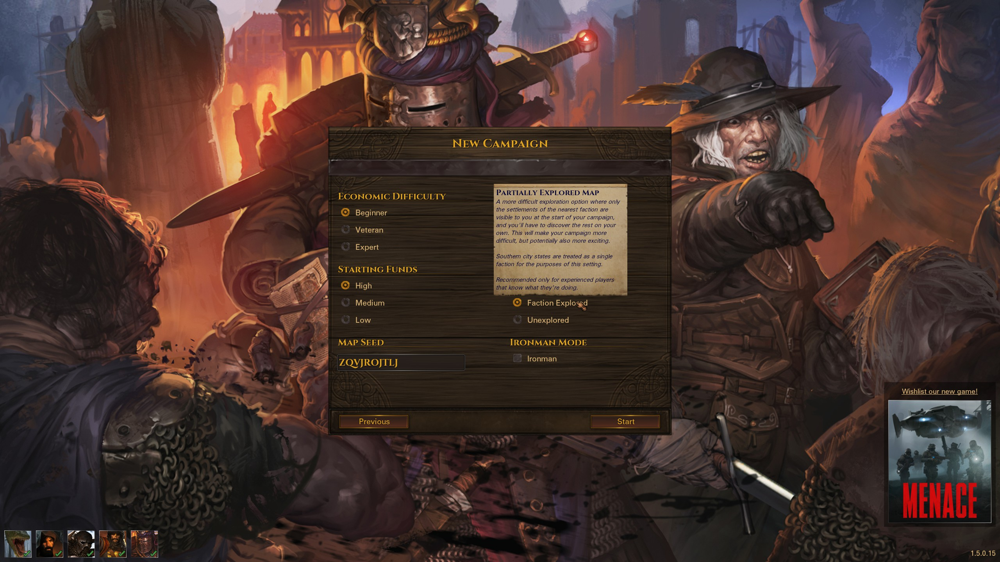
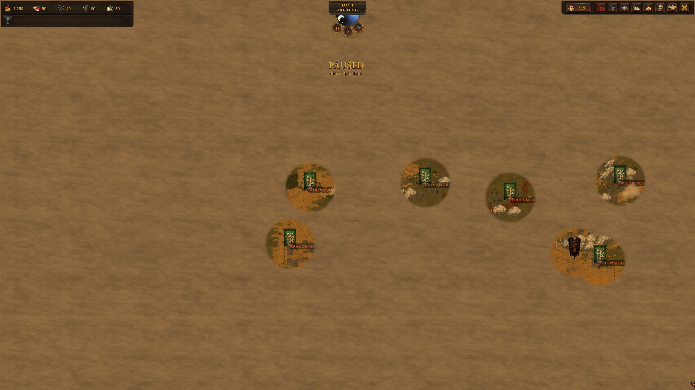

# Partially Explored Map

A mod for the game Battle Brothers ([Steam](https://store.steampowered.com/app/365360/Battle_Brothers/), [GOG](https://www.gog.com/game/battle_brothers), [Developer Site](http://battlebrothersgame.com/buy-battle-brothers/)).

## Table of contents

-   [Features](#features)
-   [Requirements](#requirements)
-   [Installation](#installation)
-   [Uninstallation](#uninstallation)
-   [Compatibility](#compatibility)
-   [Building](#building)
-   [Acknowledgements](#acknowledgements)

## Features

Adds a new "Partially Explored Map" exploration difficulty to the game that reveals all settlements of the nearest faction at campaign start, but nothing else. (If starting in the south, all city states are revealed). This is perhaps most relevant for origins that start with hostile relations to a faction, such as Deserters, where the first few days of the campaign are very swingy on unexplored.

## Requirements

1) [Modding Script Hooks](https://www.nexusmods.com/battlebrothers/mods/42) (v20 or later)

## Installation

1) Download the mod from the [releases page](https://github.com/jcsato/partially_explored_map/releases/latest)
2) Without extracting, put the `partially_explored_map_*.zip` file in your game's data directory
    1) For Steam installations, this is typically: `C:\Program Files (x86)\Steam\steamapps\common\Battle Brothers\data`
    2) For GOG installations, this is typically: `C:\Program Files (x86)\GOG Galaxy\Games\Battle Brothers\data`

## Uninstallation

1) Remove the relevant `partially_explored_map_*.zip` file from your game's data directory

## Compatibility

This is fully save game compatible, i.e. you're safe to remove the mod at any time.

There's a decent chance for incompatibilities with other mods that modify the new campaign menus. Please reach out if you encounter any issues.

## Building

To build, first copy the contents of `ini.cfg.example` to a new `ini.cfg` file and set `modkitpath` and `datapath` appropriately. Then, simply run the included `build.bat` script. This will compile and zip the mod and put it in the `dist/` directory - it will also print out any compilation errors, if any are present. The zip behavior requires Powershell / .NET to work, but there's no reason you couldn't sub in 7-zip or another compression utility if you know how and want to.

After building, you can install the mod by running the included `install.bat` script. This will take any existing versions of the mod already in your data directory, append a timestamp to the filename, and move them to an `old_versions/` directory in the mod folder; then it will take the built `.zip` in `dist/` and move it to the data directory.
